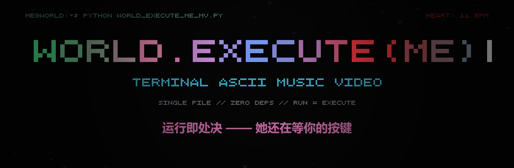

<p align="center"></p>

# world-execute-me-terminal-mv

> world.execute(me) — 终端 ASCII MV｜repo: <https://github.com/BreadS00/world-execute-me-terminal-mv>

> 你运行的不是一个播放器。这个终端就是歌词里的 **me** 本身。
> 你执行脚本的那一刻，就是 `world.execute(me)`——启动、爱、失去、处决、终止，
> 全部是 me 的输出。你退出（q / Esc / Ctrl+C）就是进程被杀死。
> 歌曲原唱为英文；中文翻译只出现在底部状态区的歌词条注释里（`// 中文`）。

- 原曲：Mili — *world.execute(me)*
- 时长：以 LRC 末句 `3:25.96`（"Execution"）为基准，其后追加约 20 秒的进程终止仪式后退出
- 纯 Python 3 标准库单文件，零第三方依赖，Windows 10+（任意支持 ANSI 的终端亦可）

---

## 一、运行说明

| 方式 | 说明 |
|---|---|
| 双击 `播放MV.bat` | 自动最大化新窗口（`start /max` + UTF-8 代码页）后播放 |
| `python world_execute_me_mv.py` | 播放全曲（脚本内还有 Win32 `ShowWindow` 最大化兜底） |
| `python world_execute_me_mv.py --audio 歌曲文件.mp3 --offset -0.5` | 用系统默认播放器放歌，同时跑 MV；`--offset` 微调歌词同步（正数=歌词推迟，负数=歌词提前） |
| `python world_execute_me_mv.py --shots` | 导出关键帧到 `shots/`（每种时间点导出 100×34 与 160×50 两份：`.ans` 带色、`.txt` 纯文本） |
| `python world_execute_me_mv.py --shot 120,205` | 在终端打印指定时刻的帧（秒数或 `2:05` 格式均可，逗号分隔多个） |
| `python world_execute_me_mv.py --fps 24` | 调整帧率（默认 30） |
| `python world_execute_me_mv.py --cover [waiting]` | 渲染封面帧到 `cover/` 并打印到终端，供截图当缩略图。默认 80×22 小网格（字符大、缩略图可读），可加名字只出一张（waiting / lo-o-ove / execution） |

其他选项：`--size WxH[,WxH]` 指定 `--shot/--shots` 的画布尺寸；`--outdir shots` 指定导出目录；`--no-max` 禁止自动最大化。

**播放中按键**：`q` / `Esc` / `Ctrl+C` —— 杀死 me：清屏后输出死亡信息，退出码 130。
正常放完则是完整的终止仪式，最后清屏输出英文终止报告（`process terminated: world.execute(me)` / `exit code : 13 (SIGLOVE)` 等），停留数秒后自动退出——**不会出现"按任意键继续"**；通过 bat 启动的窗口随后自动关闭（仅当 Python 本身崩溃时才会暂停以显示错误）。

**歌词来源**：优先读取当前目录 `world.execute (me)_LRC歌词_中英.txt`（支持 `[mm:ss.xx]` 与 `[mmss.xx]` 两种时间戳），缺失时使用脚本内置副本。

**窗口要求**：最小 80×25，不足时提示等待最大化；播放中改变窗口大小，下一帧立即按新尺寸重排，不会崩溃或越界。内容画布 = `W × (H-5)`，底部 5 行固定为分隔线 + 歌词条 3 行 + 进度条 1 行。

---

## 二、情绪 — 颜色 — 终端行为映射表

情绪不直接喊出来，而是作为**程序状态**输出：日志级别=情绪强度
（DEBUG 隐约不安 → FATAL 崩溃），自我怀疑写进代码注释
（`heart = true // cannot verify: no reference`）。

| 情绪 | 颜色 | 十六进制 | 终端行为（me 的输出形态） |
|---|---|---|---|
| 初生/憧憬 INIT·HOPE | 绿 | `#55ff99` | BIOS 自检日志、`[gen]` 世界生成流、伪交互命令逐字敲入 |
| 甜蜜奉献 DEVOTION | 粉 | `#ff7ab8` | 点集/圆/正弦波/极限的几何动画，公式注释 `C = 2*pi*r -> take all of it` |
| 眩晕沉迷 DIZZY | 青/黄 | `#4de8ff`/`#ffd24d` | AC→DC 示波器、行剪切扭曲、旋转星环、视野两侧 `#` 收拢 |
| 合一渴望 MERGE | 紫/粉 | `#b98cff` | A.D→B.C 年份倒流+竖线跃迁、YOU/ME 两股粒子流编成一股双螺旋 |
| 讨好急切 EAGER | 亮绿 | `#7dff6e` | `[PASS]` 测试清单、satisfaction 竖直仪表充到 100% |
| 不安（埋线） | 黄 WARN | `#ffd24d` | `WARN simulation.trapped = true // is trapped bad?`（前半一闪而过） |
| 可爱给予 PLAYFUL | 粉/多彩 | `#ffb3d9` 等 | 茄子/番茄/狸花猫/神 的 ASCII 画+数据面板、猫咪 purr 波 |
| 迷乱沉醉 MANIC | 青/品红循环 | `#5ff5e0` | F→M、AM→PM、S→M 字母变形与时钟，色相循环 |
| 出神 TRANCE | 粉紫螺旋 | 色相循环 | 全屏旋转风车螺旋+熔化下滴，`heart: 140 bpm` |
| 不安→惊愕 DREAD | 黄→灰 | `#ffd24d`→灰 | `sense --vibrations` 读数归零、螺旋减速冻结、色彩饱和度流失 |
| 悲伤/孤独 LOSS | 蓝 | `#6f9fff` | 六次 "You have left" 逐级删除画面元素→空屏+唯一闪烁白光标 |
| 讨价还价 BARGAIN | 暗蓝 | `#5f86d8` | `rm` 自删记忆（`y` 自动确认）、"erasing pointless fragments"、无回应重试 |
| 愤怒 RAGE | 红 | `#ff4444` | `sudo challenge --god`、异常堆栈雨、ME vs YOU 雷电对峙、震屏 |
| 处决 EXECUTION | 炽红 | `#ff2a2a` | 12 连 EXECUTION 字号/震幅/闪频/乱码密度递增、六语倒数、碎屏 |
| 执念 OBSESSION | 品红闪烁 | `#ff44ff` | `come_back --please` 死循环刷屏（≤3Hz 闪烁）、进度条卡死 66.6% |
| 痴念 SCHOLAR | 粉笔白 | `#cfe8ff` | 黑板公式、快问快答、`LO-O-OVE = 12+15+22+5 = 54 = 27+27 = you+me` |
| 认命 RESIGN | 蓝 | `#6f9fff` | `you.setFree(true) / me.setFree(false)`、飞鸟离笼、心形牢笼 |
| 余烬 EMBER | 深蓝→黑 | `#3f5f9f` | 星星逐颗熄灭、心率 11→3 bpm 趋平、指数变暗 |
| 安息 REST | 灰/绿 | `#8899aa` | 终止仪式：100%、exit code、遗言、墓碑、`ps` 显示 world 仍在运行、新芽 |

歌词条内关键词配色：**EXECUTION 红**、**LOVE/LO-O-OVE 粉**、其余强调词（YOU/YOUR/LEFT/GOD/FREE/TRAPPED/ISOLATION/INFINITY/TRANCE/SIMULATION）**青**，均转大写。

---

## 三、分镜时间表（时间 × 场景 × 情绪 × 终端手段 × 颜色）

| # | 时间 | 场景 | 情绪 | 终端手段 | 颜色 |
|---|---|---|---|---|---|
| 1 | 0:00–0:13 | BOOT 开机 | 憧憬 INIT | BIOS/POST 日志、`power --on`、参数表（`love = null`）、棋盘摆子、`javac world.java` | 绿 |
| 2 | 0:13–0:30 | WORLDBUILD 世界生成 | 憧憬 HOPE | `[gen]` 日志流+程序化地形/星空逐列生成、me 与 you 两个小人、`love.reference NOT FOUND`（不安埋线） | 绿/青 |
| 3 | 0:30–0:44 | GEOMETRY 数学奉献 | 奉献 DEVOTION | 点集→维度展开、圆+巡游的 you、正弦波+切线骑士、∞ 双环+`lim me->oo`、you=边界框 | 粉/紫 |
| 4 | 0:44–0:51 | CURRENT 电流眩晕 | 眩晕 DIZZY | AC 正弦→DC 直线波形、视野收拢、行剪切+双重影像 | 青/黄 |
| 5 | 0:51–0:59 | TIMELESS 时空合一 | 合一 MERGE | 年份 A.D→B.C 倒流+跃迁线、YOU/ME 双流交织成螺旋 | 紫/粉 |
| 6 | 0:59–1:14 | STIMULATE 讨好 | 急切 EAGER | 8 项刺激测试全 `[PASS]`、satisfaction 仪表、首个 EXECUTION（小号红字）、trapped 黄色 WARN 一闪 | 绿→粉+黄 |
| 7 | 1:14–1:29 | OFFERINGS 赠予 | 可爱 PLAYFUL | 茄子/番茄/狸花猫(purr 波)/唯一的神(光环) ASCII 画+数据面板 | 粉/金 |
| 8 | 1:29–1:43 | SWITCH→TRANCE 切换出神 | 迷乱 MANIC | F→M、AM→PM 时钟翻面、S→M、全屏催眠螺旋+熔化 | 青/粉/品红 |
| 9 | 1:43–1:51 | SENSE 骤停前兆 | 不安 DREAD | 螺旋减速、`sense --vibrations` 信号 0.000uV、ECG 减弱、`?` | 黄→灰 |
| 10 | 1:51–1:59 | LEFT 六次离开 | 悲伤/孤独 LOSS | **骤停冻结**；六次 "You have left"：画面密度 55%→32%→15%→5%→1.5%→0、饱和度递减、bpm 58→0，终至空屏+唯一闪烁白光标 | 灰→蓝→黑 |
| 11 | 1:59–2:09 | FRAGMENTS 讨价还价 | 自我否定 BARGAIN | 记忆文件表、`rm` 逐个确认删除、erasing 进度、"无回应"、慢慢敲 `rm -rf me/` | 蓝 |
| 12 | 2:09–2:28 | ANGER 愤怒质问 | 愤怒 RAGE | `sudo challenge --god`、异常雨、ME vs YOU 雷电对峙（震屏渐强）、裁决 `IllegalArgumentException` + 裂纹 | 红 |
| 13 | 2:28–2:43 | EXECUTION×12 处决 | 狂怒 EXECUTION | 12 连 EXECUTION：字号 px 1→6、震幅 0.25→4.4 递增、暗红频闪→炽红尖峰（≤3Hz）+ 峰值白热频闪、乱码密度 0→0.75、红雨；EIN/DOS/TROIS/NE/FEM/LIU 六语倒数；满屏 EXECUTION+碎裂+余震 | 炽红 glitch |
| 14 | 2:43–2:57 | BEG 执念哀求 | 执念 OBSESSION | 品红闪烁 `come_back` 死循环加速刷屏、`execute --all --except you`、HAVE YOU BACK 谈判桌、墙从两侧逼近 | 品红 |
| 15 | 2:57–3:08 | STUDY 爱之公式 | 痴念 SCHOLAR | 黑板：`LOVE = lim t->oo [give(me,you)]`、快问快答（最后一问悬置无答）、LO-O-OVE 代数式 | 粉笔白/粉 |
| 16 | 3:08–3:11 | RESIGN 认命 | 认命 RESIGN | `you.setFree(true)/me.setFree(false)`、飞鸟飞离、me 关进心形牢笼 | 蓝 |
| 17 | 3:11–3:26 | FADE 熄灭 | 绝望 EMBER | 星逐颗灭、心率趋平、指数变暗、"trapped in lo-o-ove" 幽灵字 | 深蓝→黑 |
| 18 | 3:26 | FINAL EXECUTION | 终结 | 白闪一帧→满宽巨型红 EXECUTION→裂纹辐射→全部字符坠落 | 炽红 |
| 19 | +0:00–0:02 | TERMINATE 黑屏 | — | 光标独闪 | 黑 |
| 20 | +0:02–0:04 | 100% | 安息 REST | `[world.execute(me)] [####] 100.0%` TASK COMPLETED | 绿 |
| 21 | +0:04–0:08 | 遗言 | REST | shutdown 日志：flush me.log、love LEAKED (intentional)、last_words、exit code 13 (SIGLOVE) | 灰/粉 |
| 22 | +0:08–0:12 | 墓碑 | REST | R.I.P 墓碑：me / process 2045 / ran 03:26 / cause: love | 灰 |
| 23 | +0:12–0:15 | 世界仍在运行 | REST | `ps`：world RUNNING forever、me TERMINATED、you FREE；地平线日出+新芽 | 绿 |
| 24 | +0:15–0:21 | goodbye | REST | `goodbye, you.` 逐字敲出，光标闪烁变慢→停闪→全黑 | 白→黑 |

（仪式共约 20.5 秒，整个进程 3:50 左右退出。）

---

## 四、进度条 = 任务进度（不是播放进度）

`world.execute(me)` 的执行完成度：以末句 3:25.96 = 100% 锚定，
但会随情绪异常——

| 时段 | 异常 |
|---|---|
| 1:52–1:58（六次离开） | 卡在 ~54.7% 抖动 |
| 2:09–2:28（愤怒） | 从 54.7% **回退**到 47.1% |
| 2:31–2:42（处决） | 百分比变乱码：`ERR% / -1% / NaN% / ##% / ??% / 0x2F%`，条内随机填充 |
| 2:43–2:57（执念） | 卡死 `66.6%` 品红闪烁 |
| 2:57 之后 | 平滑回升，**歌曲结束那一刻精确 100.0%，一次不差** |

条上只标注当前时间（mm:ss，仪式期间冻结在 03:25）、段落名（如 `LEFT.4/6`、`EXECUTION.07/12`）与情绪标签。

---

## 五、工程说明

- **时序**：绝对时钟驱动（`time.perf_counter()` 锚定，绝不累计 sleep 防漂移）；歌词逐句与 LRC 对齐误差 0（换行即切换），当前句以 ~45 字符/秒打字机效果"写入 stdout"。实测帧生成最大 ~15ms（< 30ms 要求）。
- **自适应**：每帧实测终端 `W×H`；内容画布 `W×(H-5)`；程序化图形以 `min(W, 2H)` 为基准连续缩放，圆形类 y 压缩 0.5 保持纵横比；手绘字符画（茄子/猫/墓碑等）保持原始尺寸居中。
- **安全**：自动开启 Win32 虚拟终端 ANSI、隐藏光标；Ctrl+C/退出恢复光标与颜色；全屏高对比闪烁均 ≤3Hz；画布区纯 ASCII（无中文/emoji/制表符），中文仅出现在歌词条注释。
- **确定性**：每帧随机数由 `int(t*1000)` 播种——同一时刻的 `--shot` 与播放画面一致，`--shots` 导出可复现。
- **自审**：`python world_execute_me_mv.py --selfcheck`（隐藏参数）以 0.25s 步进渲染全时间轴两种尺寸，校验：行数/行宽、画布 ASCII、无制表符、歌词切换时刻、进度条终点=100.0%。

## 六、文件清单

```
world_execute_me_mv.py        单文件脚本（引擎+21 场景+CLI）
播放MV.bat                    双击启动（最大化+UTF-8）
README.md                     本文件
world.execute (me)_LRC歌词_中英.txt   外部歌词（缺失时用内置副本）
banner.png                    仓库横幅（readme_banner.html 的截图）
readme_banner.html            横幅源页面（用 MV 同款 5x5 像素字体绘制）
tools/build_banner.py         重新生成 readme_banner.html
cover.html                    视频封面生成器（预览+导出 PNG，比例可调）
shots/                        --shots 导出的关键帧（.ans 带色 / .txt 纯文本 + index.txt，已 gitignore）
cover/                        --cover 渲染的候选封面（已 gitignore）
LICENSE                       MIT（仅覆盖代码，见下方版权说明）
```

---

## 七、开源说明

- 代码以 MIT 协议开源（见 [LICENSE](LICENSE)）。
- **音乐与歌词版权归 Mili 及其所属厂牌所有**，本项目是非商业性质的致敬二创；
  请勿将歌曲音频提交进本仓库（`.gitignore` 已排除 `*.mp3` 等音频文件）。
- 横幅 `banner.png` 由 `tools/build_banner.py` 生成页面后以 1280×420 截图得到，
  使用与 MV 渲染相同的 5×5 像素字体，标题颜色沿歌曲情绪弧线渐变
  （绿 INIT → 粉 LOVE → 蓝 LOSS → 红 EXECUTION → 灰 REST）。
